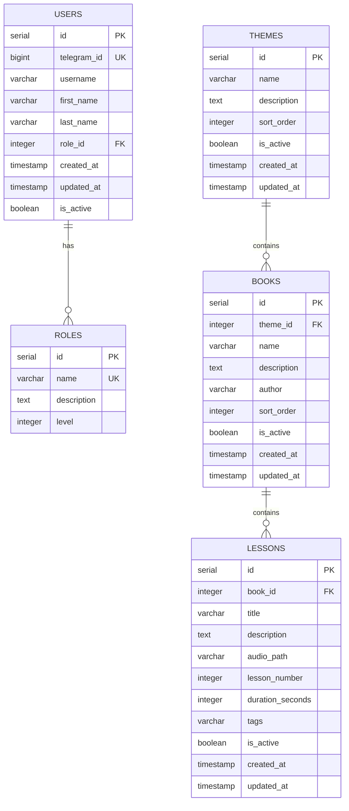

# Архитектура Telegram бота для аудио уроков

## Общая архитектура

### Технологический стек
- **Язык программирования**: Python 3.11+
- **Библиотека для Telegram**: aiogram 3.x
- **База данных**: PostgreSQL
- **Контейнеризация**: Docker + Docker Compose
- **Хранение аудио**: Локальные файлы, монтируемые в контейнер

### Структура проекта
```
telegram_audio_bot/
├── bot/
│   ├── __init__.py
│   ├── main.py              # Запуск бота
│   ├── handlers/            # Обработчики команд
│   │   ├── __init__.py
│   │   ├── admin.py         # Админские команды
│   │   ├── user.py          # Пользовательские команды
│   │   └── common.py        # Общие команды
│   ├── keyboards/           # Клавиатуры
│   │   ├── __init__.py
│   │   ├── admin.py
│   │   └── user.py
│   ├── models/              # Модели данных
│   │   ├── __init__.py
│   │   ├── database.py      # Работа с БД
│   │   ├── user.py          # Модель пользователя
│   │   ├── theme.py         # Модель темы
│   │   ├── book.py          # Модель книги
│   │   └── lesson.py        # Модель урока
│   ├── services/            # Бизнес-логика
│   │   ├── __init__.py
│   │   ├── auth_service.py  # Аутентификация и роли
│   │   ├── admin_service.py # Админские функции
│   │   └── user_service.py  # Пользовательские функции
│   ├── utils/               # Утилиты
│   │   ├── __init__.py
│   │   ├── config.py        # Конфигурация
│   │   └── audio_utils.py   # Работа с аудио
│   └── audio_files/         # Хранение аудио файлов
├── data/                    # Файлы данных
│   └── postgres/            # Файлы PostgreSQL
│       └── data/            # Данные БД
├── docker/                  # Docker конфигурация
│   ├── Dockerfile
│   ├── docker-compose.yml
│   └── init.sql             # Инициализация БД
├── requirements.txt         # Зависимости Python
├── .env                     # Переменные окружения
└── README.md               # Инструкция по развертыванию
```

## Архитектура базы данных

### Схема данных



### Описание таблиц

#### ROLES (Роли пользователей)
- `id` - уникальный идентификатор роли
- `name` - название роли (admin, moderator, user)
- `description` - описание роли
- `level` - уровень доступа (0 - пользователь, 1 - модератор, 2 - админ)

#### USERS (Пользователи)
- `id` - уникальный идентификатор
- `telegram_id` - ID пользователя в Telegram
- `username`, `first_name`, `last_name` - данные из Telegram
- `role_id` - ссылка на роль
- `is_active` - активность пользователя

#### THEMES (Темы)
- `id` - уникальный идентификатор
- `name` - название темы (Акыда, Сира, Фикх, Адаб)
- `description` - описание темы
- `sort_order` - порядок сортировки

#### BOOKS (Книги)
- `id` - уникальный идентификатор
- `theme_id` - ссылка на тему
- `name` - название книги (например, "4 правила")
- `author` - автор книги
- `sort_order` - порядок сортировки в теме

#### LESSONS (Уроки)
- `id` - уникальный идентификатор
- `book_id` - ссылка на книгу
- `teacher_id` - ссылка на преподавателя урока
- `title` - название урока
- `description` - описание урока
- `audio_path` - путь к аудиофайлу
- `lesson_number` - номер урока в книге
- `duration_seconds` - длительность в секундах
- `tags` - теги для поиска и фильтрации

## Функциональные возможности

### Для администратора
- Управление темами (создание, редактирование, удаление)
- Управление авторами книг (создание, редактирование, удаление)
- Управление преподавателями уроков (создание, редактирование, удаление)
- Управление книгами (создание, редактирование, удаление)
- Управление уроками (добавление аудио, редактирование, удаление)
- Управление пользователями и ролями
- Статистика использования бота

### Для модератора
- Добавление и редактирование уроков в существующих книгах
- Редактирование информации об уроках
- Управление тегами и нумерацией
- Добавление новых преподавателей уроков

### Для пользователя
- Просмотр списка тем
- Просмотр книг в выбранной теме
- Прос уроков в книге
- Прослушивание аудио уроков
- Поиск по тегам

## Безопасность
- Проверка прав доступа для каждой команды
- Валидация входных данных
- Ограничение размера загружаемых аудиофайлов
- Резервное копирование базы данных

## Масштабирование
Возможность миграции на PostgreSQL в будущем без изменения архитектуры приложения.